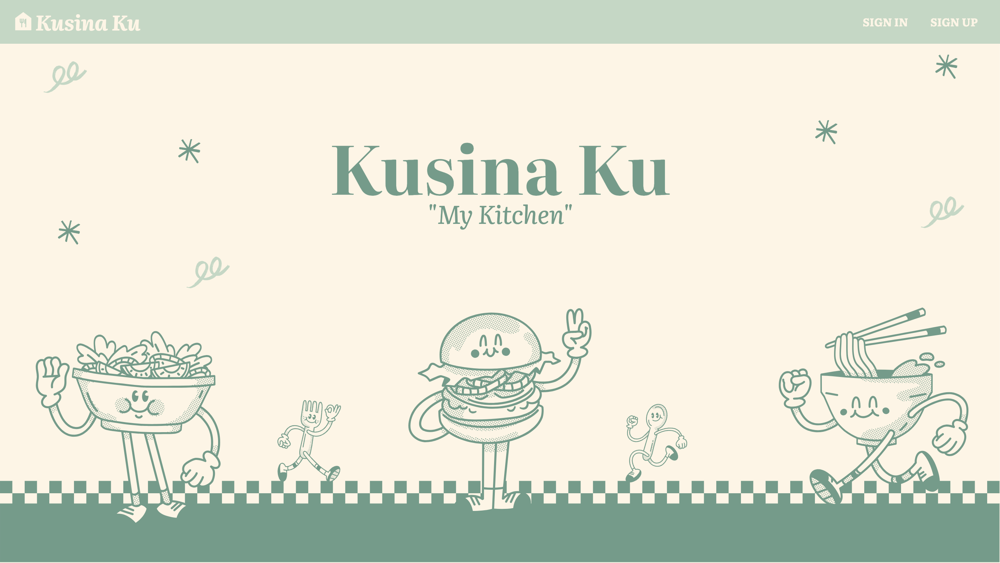
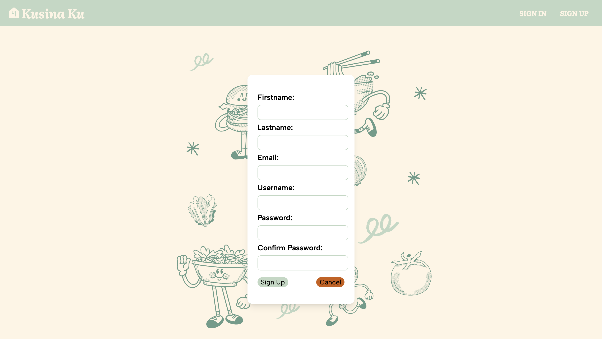
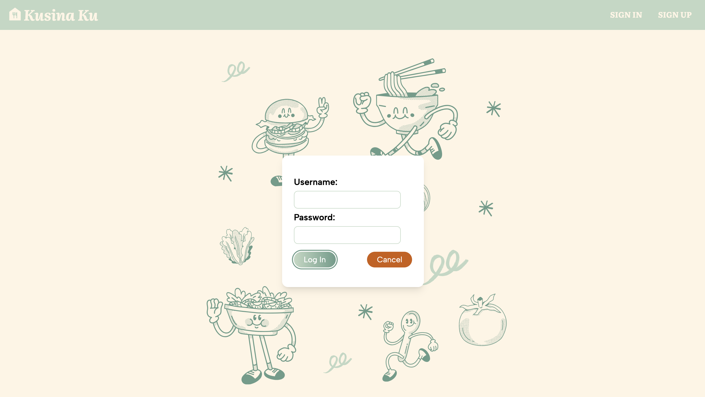
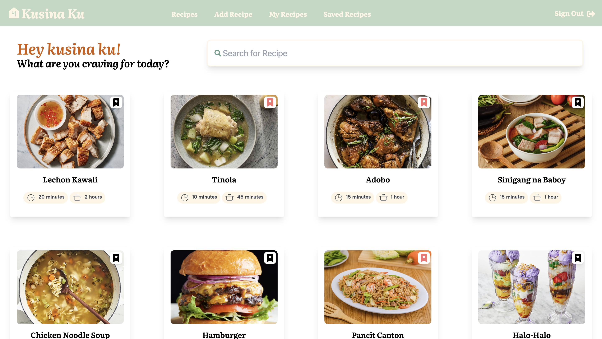
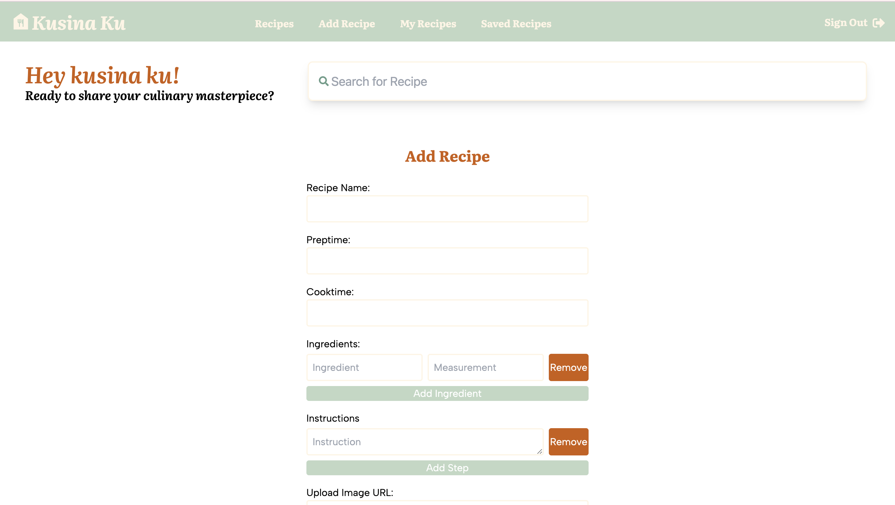

<a href="https://www.linkedin.com/in/gabtongol128/">by Gabrielle Tongol</a>

Kusina Ku is a cookbook application where users can explore, share, and organize their favorite recipes.

## 👩🏻‍🍳 FEATURES

- **Create and Share Recipes:** Users can create new recipes and choose to publish them publicly for others to see.
- **Explore Community Recipes:** View and browse recipes posted by other users to discover new culinary inspirations.
- **Manage Your Recipes:** Edit or delete your own recipes and posts to keep your collection up-to-date.
- **Interact with the Community:** Comment on recipes shared by other users to provide feedback or ask questions.

## 👩🏻‍🍳 SCREENSHOTS

## 👩🏻‍🍳 TECHNOLOGIES USED

Backend: https://github.com/gabvint/recipe-api-back-end
 

## 👩🏻‍🍳 GETTING STARTED

 Project planning in trello: https://trello.com/invite/b/66c6838c7234a2281b8c499b/ATTIf8ccdf1f343058c4de3f81d48996ff6f20C42EA2/kusina-ku-my-kitchen

Link to the website:
https://kusinaku.netlify.app/

## 👩🏻‍🍳 FUTURE PLANS

- **Recipe Ratings:** Implement a rating system for users to rate each recipe, with automatic computation of average ratings.
- **User Profiles:** Develop a profile view where users can update their personal information and manage their account settings.
- **Image Upload:** Enable users to upload images directly from their own devices to enhance their recipe entries.
- **Advanced Sorting:** Introduce sorting features that allow users to browse recipes by various categories, including food from different nationalities, cuisine types, difficulty levels, and preparation times.
- **Enhanced Search:** Improve the search functionality to support more refined queries and filters.

